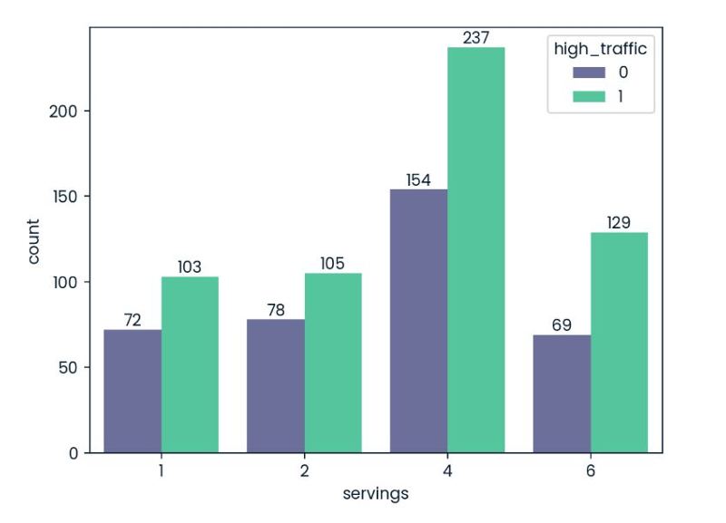
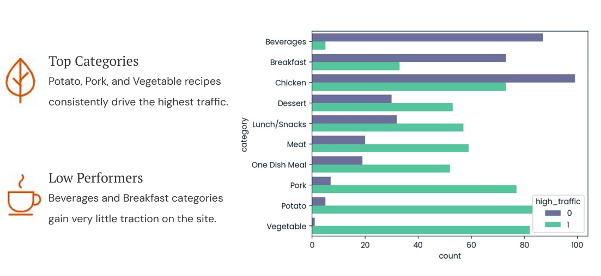
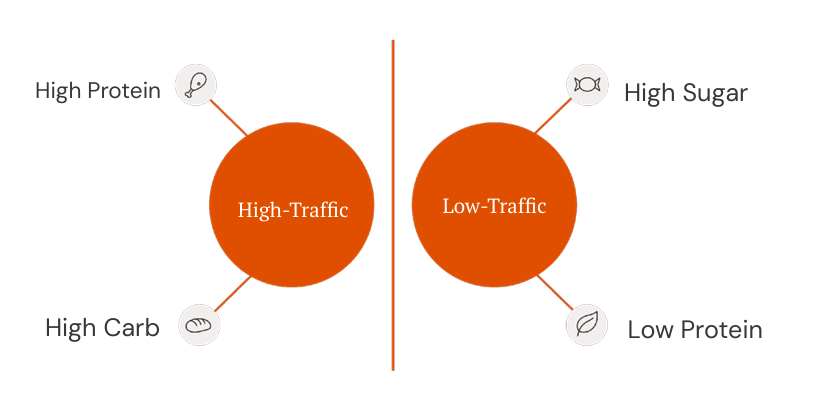
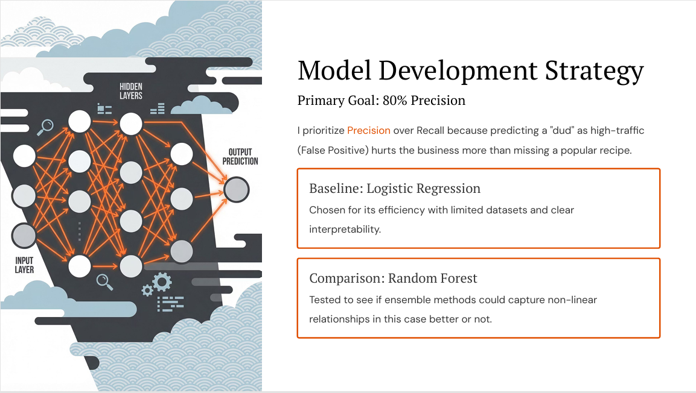
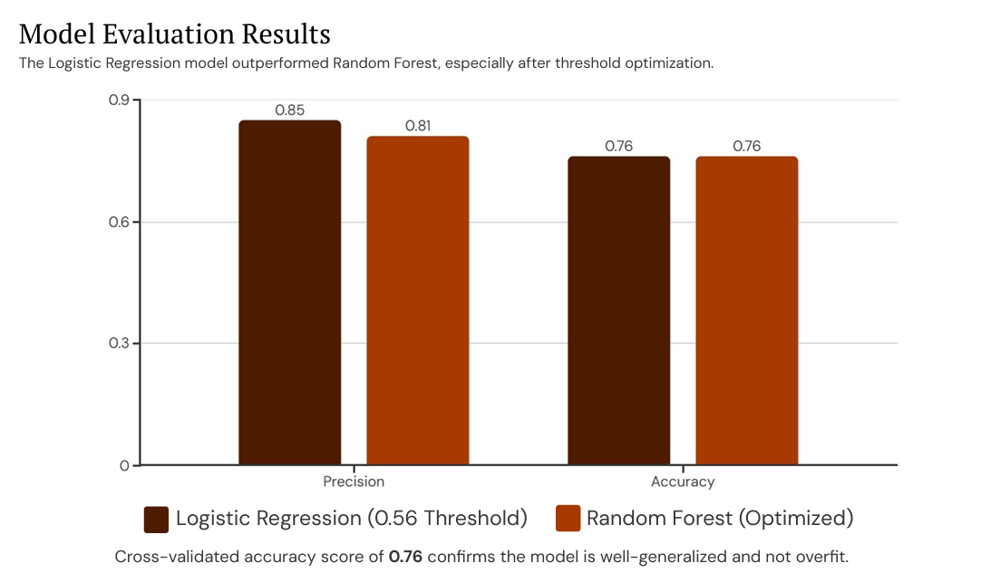
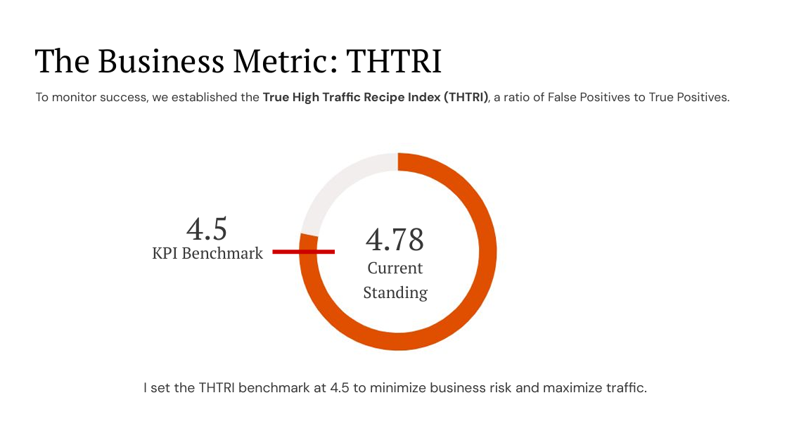
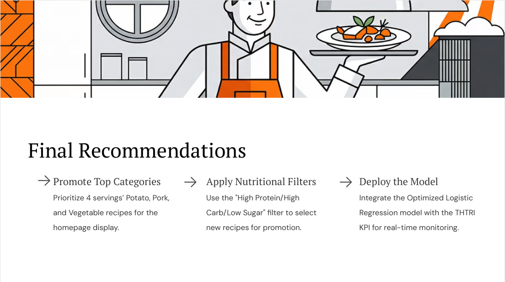

# Recipe Site Traffic Prediction 🍲📈

[](https://opensource.org/licenses/MIT)
[](https://www.python.org/)
[](https://jupyter.org/)
[](https://github.com/soaer01/recipe-site-traffic-prediction)

A data science project predicting high-traffic recipes for Tasty Bytes. Using machine learning, we identify patterns in servings, categories, and nutrition to optimize site engagement.

- **Achieved**: 76% accuracy with Optimized Logistic Regression.
- **Business Impact**: Custom KPI (THTRI ≥ 4.5) to minimize false positives and boost traffic.
- **Audiences**: Non-technical (slides PDF) | Technical (Jupyter notebook).

Completed January 2026 as part of Data Scientist Professional Practical Exam.

## 🚀 Project Overview
This end-to-end project analyzes 947 recipes to predict popularity based on calories, carbs, sugar, protein, category, and servings. Key workflow:
- **Cleaning & Validation**: Imputed nulls, standardized categories.
- **EDA**: Uncovered trends like "The Four Rule" (4 servings dominate).
- **Modeling**: Logistic Regression vs. Random Forest; prioritized precision.
- **Evaluation**: Cross-validated at 0.76 accuracy.
- **Business Metric**: THTRI for monitoring.

## 🔍 Key Insights
From exploratory analysis:

### Impact of Serving Size

- Meals for 4 servings drive the most traffic ("The Four Rule").

### Categorical Influence

- **Top**: Potato, Pork, Vegetable.
- **Low**: Beverages, Breakfast.

### Nutritional Drivers

- High-traffic recipes: High protein/carbs, low sugar.
- Insight: Less sugar correlates with popularity across servings.

## 📊 Model Development & Evaluation

- **Goal**: 80% precision to avoid "dud" predictions.
- **Baseline**: Logistic Regression (efficient & interpretable).
- **Comparison**: Random Forest (tested for non-linearity).


- Logistic Regression wins: 0.85 precision, 0.76 accuracy (threshold-optimized).
- Cross-validation confirms no overfitting.

## 📈 Business Metric: THTRI

- **True High Traffic Recipe Index** = True Positives / False Positives.
- Benchmark: ≥ 4.5 to maximize traffic while minimizing risk.

## 🎯 Recommendations

- **Promote Top Categories**: Feature 4-serving Potato/Pork/Vegetable recipes on homepage.
- **Nutritional Filters**: Select high-protein/carb, low-sugar recipes.
- **Deploy Model**: Integrate Logistic Regression with THTRI for real-time monitoring.

## For Non-Technical Audience: Presentation Slides
View the polished, visual PDF tailored for stakeholders:
- [**Download Slides PDF**](Recipe%20Site%20Traffic%20-%20Popularity%20Prediction%20Presentation.pdf) (10 pages, easy-to-digest insights).

## For Technical Audience: Jupyter Notebook
Dive into the code:
- [**View Notebook**](notebook.ipynb) (Full cleaning, EDA, modeling, and evaluation).

## 🛠️ Setup & Reproduction
1. Clone the repo:
   ```bash
   git clone https://github.com/yourusername/recipe-site-traffic-prediction.git
   cd recipe-site-traffic-prediction
   ```
2. **Install dependencies:**
   ```bash
   pip install -r requirements.txt
   ```
3. **Run the notebook:**
   ```bash
   jupyter notebook notebook.ipynb
   ```
- **Data:** In `/data/recipe_site_traffic_2212.csv`.
- **Environment:** Python 3.8+.

---

### 📝 Results Summary

| Model | Precision | Accuracy | THTRI (Test) |
| :--- | :---: | :---: | :---: |
| **Logistic Regression** | 0.85 | 0.76 | 5.61 |
| **Random Forest** | 0.81 | 0.76 | 4.39 |

---

### 📄 License

MIT License – see [LICENSE](./LICENSE) for details.

### 👋 Contact

- **Author:** Mian Afzal Saeed  
- **Issues?** Open a [GitHub Issue](../../issues).
- **Star ⭐ if useful!** 

**Boost your portfolio – fork and adapt!**
