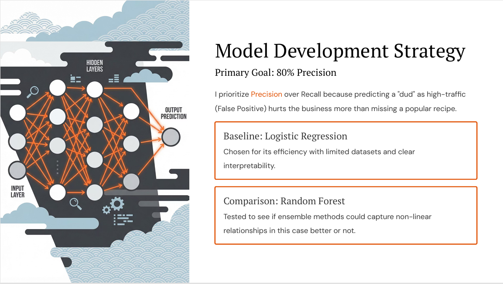
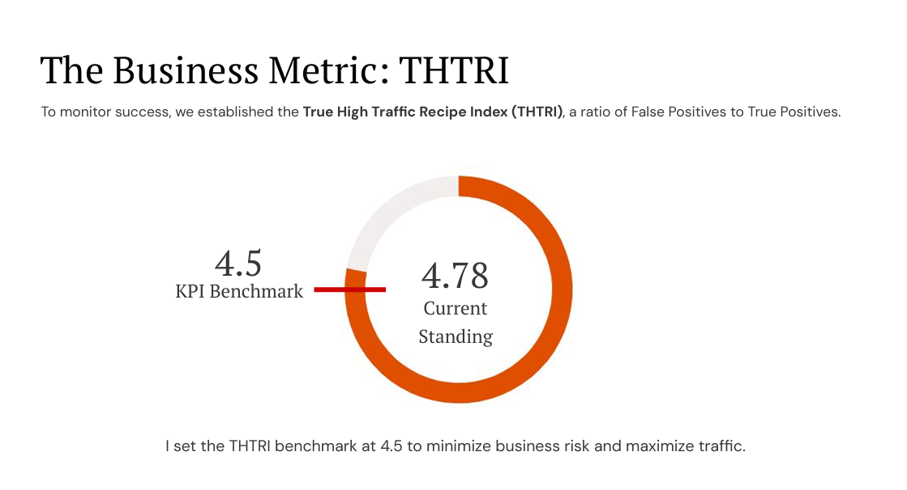
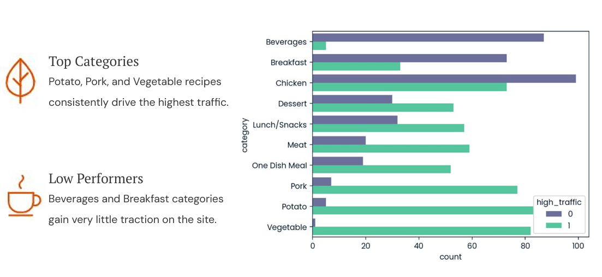

# Recipe Site Traffic Prediction

> **Predictive Analytics & Business KPIs for Content Strategy Optimization**

## Overview

A machine learning solution designed to forecast high-engagement recipes and optimize content strategy for a recipe website. The project encompasses end-to-end data science workflow from exploratory analysis to production-ready model deployment.

## Key Achievements

- **Predictive Modeling**: Built and enhanced a Logistic Regression model achieving **76% Accuracy** and **85% Precision**, outperforming Random Forest baselines
- **Business Impact**: Defined and monitored the **THTRI** (Total High Traffic Recipe Index) KPI to help stakeholders track content performance
- **Exploratory Analysis**: Conducted deep EDA on **900+ recipes**, identifying "High Protein" and "Potato/Vegetable" categories as primary engagement drivers
- **Production Rollout**: Operationalized a production-ready inference script (`model.py`) and executive presentation

## Technology Stack

| Layer | Technologies |
|-------|-------------|
| ML Framework | Scikit-Learn |
| Data Processing | Pandas, NumPy |
| Visualization | Matplotlib, Seaborn |
| Deployment | Python (model.py) |

## Project Structure

```
├── data/                  # Raw and processed datasets
├── images/                # Visualization outputs
├── notebook.ipynb         # Full analysis notebook
├── model.py               # Production inference script
├── requirements.txt       # Python dependencies
└── Presentation.pdf       # Executive summary deck
```

## Key Visualizations

### Model Strategy


### THTRI Metric


### Category Influence


---
*Developed by Mian Afzal Saeed | DataCamp Practical Exam Project*
